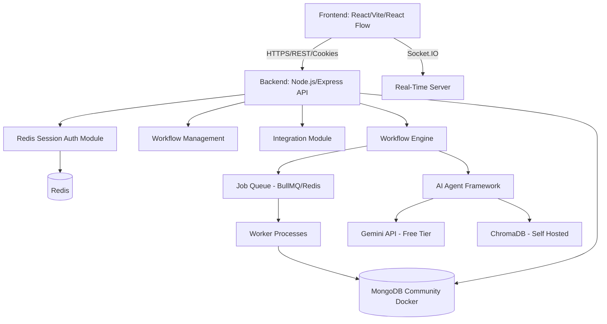

# Internal Automation Builder - Implementation Plan

This document outlines the architecture, design, and phased implementation strategy for the Internal Automation Builder, an AI-powered enterprise workflow automation platform. 

**Core Constraint: 100% Free & Self-Hosted (with Free Tier APIs)**. We are designing this architecture to rely on open-source self-hosted infrastructure, supplemented by highly capable free-tier APIs (like Gemini).

## User Review Required

> [!WARNING]
> Please review the finalized architecture, tech stack, and phase breakdown. Once approved, we will immediately begin with Phase 1.

## Resolved Technical Decisions

> [!NOTE]
> 1. **AI Provider (Gemini API)**: We will use the **Google Gemini API** (Free Tier). It provides exceptional reasoning capabilities, a massive context window, and is free for our usage level, offloading the heavy compute requirements that local models (like Ollama) would demand.
> 2. **Authentication (Redis Sessions > JWT)**: Instead of JWTs (which require CPU overhead for cryptographic verification on every request), we will implement **Redis-backed HTTP-only Sessions**. Since we already need Redis for our workflow queue, using it as a session store provides blazingly fast `O(1)` memory lookups for authentication, superior security against XSS, and instantaneous session revocation.
> 3. **Workflow Engine Queueing**: We will use Redis (via BullMQ) hosted locally in Docker for robust job queueing and retries. 
> 4. **Language**: We will use TypeScript across the entire stack (Frontend and Backend) for enterprise-grade type safety.

## 1. System Architecture

The system follows a modern, scalable Modular Monolith approach for the backend, with a decoupled frontend, prepared for future microservice extraction. Everything is orchestrated via Docker Compose.

## 2. Technology Stack (100% Free / Open Source)
- **Frontend**: React 18, Vite, React Router, Tailwind CSS, ShadCN UI, React Flow (drag-and-drop), React Query (TanStack), Zustand (State Management), React Hook Form, Zod.
- **Backend**: Node.js (TypeScript), Express.js, Socket.IO, BullMQ (Redis for queues), `express-session` + `connect-redis`.
- **Database**: MongoDB Community Edition (Self-hosted via Docker), Redis (Sessions, Caching, and Queues).
- **AI Layer**: LangChain (JS/TS), Google Gemini API, HuggingFace/Gemini Embeddings, ChromaDB (Self-hosted Vector DB).
- **Infrastructure**: Docker, Docker Compose (Deployable to any raw Linux VPS).

## 3. Database Schema Design (High Level)
- **Users**: `_id`, `name`, `email`, `passwordHash`, `role` (Super Admin, Admin, Automation Manager, Team Lead, Employee).
- **Workflows**: `_id`, `name`, `description`, `triggerType`, `nodes` (JSON array), `edges` (JSON array), `status`, `createdBy`.
- **WorkflowExecutions**: `_id`, `workflowId`, `status` (pending, running, success, failed), `logs` (array of step executions), `startTime`, `endTime`.
- **Integrations**: `_id`, `provider` (Slack, SMTP, Custom Webhooks), `credentials` (encrypted locally), `status`.

## 4. Workflow Engine Architecture
The workflow engine will process DAGs (Directed Acyclic Graphs).
1. **Trigger**: Webhook, Schedule (Cron), or Manual execution inserts a Job into the Queue.
2. **Worker**: Picks up the job, retrieves the Workflow definition and initial payload.
3. **Execution Loop**: Topologically sorts the nodes. Executes nodes sequentially or in parallel based on edges.
4. **State Management**: Node inputs/outputs are passed in an `executionCtx` object to subsequent nodes.
5. **AI Nodes**: Delegated to the AI Agent Framework which utilizes the Gemini API and contextual memory.

## 5. AI Agent Architecture
- **Agent Orchestrator**: Manages agent lifecycle, system prompts, and conversation memory.
- **Tools**: Pre-defined functions (e.g., `search_db`, `send_email`, `extract_resume`) exposed to Gemini via Function Calling.
- **RAG Pipeline**: Vector embeddings for internal documents stored in a local ChromaDB instance to provide context to agents (Knowledge Assistant).

## Proposed Implementation Phases

### Phase 1: Project Scaffolding, Auth, & Infrastructure
- Setup monorepo structure (`frontend`, `backend`).
- Initialize Docker Compose configuration (MongoDB, Redis, Node backend, ChromaDB).
- Implement Redis-backed Session Authentication & Role-Based Access Control (RBAC).
- Setup REST API structure, error handling, and logging.

### Phase 2: Core Workflow Engine & Management API
- Build Workflow CRUD APIs.
- Implement the core Node-based execution engine in the backend.
- Integrate BullMQ for job processing, parallel execution, and retries.
- Implement basic Trigger & Action nodes (Manual, Webhook, HTTP Request, Send Email via standard SMTP).

### Phase 3: Visual Workflow Builder (Frontend)
- Setup React Flow with custom Nodes and Edges.
- Build the drag-and-drop canvas and Node configuration sidebars.
- Connect Frontend to Workflow CRUD APIs.
- Build the overarching Dashboard (KPIs, Activity Feed).

### Phase 4: Gemini AI Integration & Agents
- Integrate LangChain with Google Gemini API.
- Build AI Action Nodes (Summarize, Extract, Decide).
- Implement the AI Workflow Generator (Text-to-Workflow capability).
- Build specific Agents (HR Resume Analyzer, Support ticket router).

### Phase 5: Internal App Builder & Real-Time Monitoring
- Build dynamic forms rendering engine for the internal app builder.
- Create the Analytics Dashboard and Execution Logs UI.
- Implement Real-Time notifications via Socket.IO for approvals and failures.
